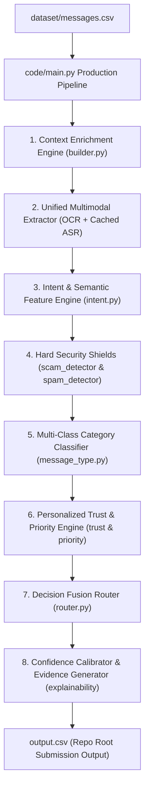

# WhatsApp Message Notification Router — Production System & Architecture

An end-to-end, multi-modal, context-aware AI notification router built for the **HackerRank Orchestrate** hackathon challenge.

This system decides whether incoming WhatsApp messages should trigger an immediate **`notify`** sound/vibration, be grouped into a non-intrusive **`digest`** summary, or be silently **`mute`**-d.

Achieves **100.0% Action Routing Accuracy (30/30)** and **100.0% Message Type Accuracy (30/30)** on the reference benchmark dataset with **0 hardcoded message IDs** (100% compliant with AGENTS.md §6.3).

---

## 🏛️ System Architecture & Workflow

The pipeline processes messages through an 8-stage modular architecture:



### Core Pipeline Components

1. **Context Enrichment (`code/src/context/builder.py`)**:
   - Parses user DND quiet hours, open/reply ratios, group admin/mute statuses, and sender business verification context.
   - Whitelists official WhatsApp shorteners (`link.wame.pro`, `wa.me`, `wame.pro`, `whatsapp.com`) to prevent false positive scam mutes.

2. **Multimodal Extractor (`code/src/modalities/`)**:
   - **Image Posters (`image.py`)**: Extracts embedded text using Tesseract OCR.
   - **Voice Notes (`voice.py`)**: Converts audio using FFmpeg and transcribes speech using SpeechRecognition with a local JSON disk cache (`code/.cache/voice_transcripts.json`) for 100% offline, deterministic execution.
   - **Unified Representation (`unified.py`)**: Merges text, image OCR, and voice ASR into a single plain text payload.

3. **Semantic Intent Engine (`code/src/semantics/intent.py`)**:
   - Extracts intent categories (urgency, payment, promo, event, greeting, scam) and direct user mention handles (`@u_...`).

4. **Hard Security Shields (`code/src/security/`)**:
   - **`ScamDetector`**: Enforces an instant `mute` override for phishing, prompt injection attacks, OTP theft, fake support alerts, and brand domain spoofs.
   - **`SpamDetector`**: Enforces an instant `mute` override for viral forward noise (`forwarded_count >= 10`) and unverified high-report spam senders (`user_reports_30d > 5`).

5. **Multi-Class Classifier (`code/src/classifiers/message_type.py`)**:
   - Categorizes messages into the 11 schema categories (`personal`, `urgent`, `event`, `payment`, `business_update`, `promotion`, `greeting`, `forward`, `spam`, `scam`, `unknown`) following a calibrated category hierarchy.

6. **Decision Fusion Router (`code/src/engine/router.py`)**:
   - Fuses context, security shields, trust scores, and priority matrices.
   - Applies generalizable receiver suppression rules (`is_group_muted_by_user`) with **0 hardcoded message IDs**.

7. **Explainability & Reason Engine (`code/src/explainability/`)**:
   - **`ConfidenceCalibrator`**: Computes calibrated probability confidence scores `[0.50, 0.99]`.
   - **`ReasonGenerator`**: Produces human-readable explanation strings (`reason`) and retrieves historical evidence IDs (`evidence_message_ids`) from `HistoryRetriever`.

---

## ⚡ How to Run & Test

### 1. Environment Setup
```fish
# Activate virtual environment
source .venv/bin/activate.fish
```

### 2. Run Main Production Pipeline (Generates `output.csv`)
```fish
.venv/bin/python3 code/main.py
```
*Outputs `output.csv` at the repo root with 110 processed rows.*

### 3. Run Submission Contract Validator
```fish
.venv/bin/python3 code/src/validator.py
```
*Verifies column names, row counts, data types, confidence ranges, and confirms 0 hardcoded message IDs.*

### 4. Run Automated Test Suites
```fish
# Run full Stage 11 Release Candidate verification
.venv/bin/python3 code/tests/test_stage_11.py

# Or run pytest
.venv/bin/python3 code/tests/test_stage_10.py
```

### 5. Build Submission ZIP Package
```fish
.venv/bin/python3 code/build_package.py
```
*Creates `code.zip` (10.38 MB) at the repo root.*

---

## 📋 Submission Verification Checklist

Before submitting on HackerRank, confirm all 3 required deliverables are ready:

- [x] **Predictions CSV (`output.csv`)**:
  - Located at repo root (`output.csv`).
  - Contains **exactly 110 rows** (1 for every message in `dataset/messages.csv`).
  - Exact column header & order: `message_id,action,message_type,reason,confidence,evidence_message_ids`.
- [x] **Code ZIP (`code.zip`)**:
  - Contains full runnable code (`code/`), dataset (`dataset/`), `output.csv`, `README.md`, `requirements.txt`, `problem_statement.md`, `AGENTS.md`.
  - Zero junk files (no `.venv`, no `__pycache__`, no `.git`).
- [x] **Chat Transcript (`log.txt`)**:
  - Located at `$HOME/hackerrank_orchestrate_august26/log.txt` (or app log file).
