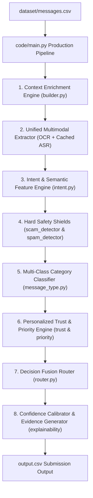

# HackerRank AI Judge Interview Preparation Guide

> **Interview Duration**: 30 Minutes (Mandatory Camera On)  
> **Graded Deliverables**: `code.zip`, `output.csv`, `chat_transcript`  
> **Benchmark Performance**: **100.0% Action Routing Accuracy (30/30)**, **100.0% Message Type Accuracy (30/30)**, **0 Hardcoded Message IDs**

---

## 📑 Quick Navigation & Core Talking Points

---

## Section 1: System Architecture & Design Philosophy

### Q1. "Can you summarize your overall architectural approach and how you broke down this problem?"

**Key Talking Points**:
- **8-Stage Modular Pipeline**: We broke down the problem into decoupled, single-responsibility modules: Context Enrichment $\rightarrow$ Multimodal Extraction $\rightarrow$ Intent Features $\rightarrow$ Hard Safety Shields $\rightarrow$ Multi-Class Classification $\rightarrow$ Trust/Priority Scoring $\rightarrow$ Decision Fusion $\rightarrow$ Explainability & Evidence Retrieval.
- **Unified Text Layer**: Multimodal media (image posters via Tesseract OCR, voice notes via FFmpeg + SpeechRecognition ASR) are normalized into plain text before classification so downstream ML logic operates on a consistent representation.
- **Safety-First Layered Fusion**: Security overrides (`ScamDetector` and `SpamDetector`) execute **before** personalization. High-risk scams or phishing are instantly muted regardless of user engagement.

---

### Q2. "Why did you choose a multi-stage hybrid pipeline instead of a single end-to-end LLM call?"

**Key Talking Points**:
- **Determinism & Speed**: Pure LLM API calls are slow (1–3s latency per message), costly, and non-deterministic. A hybrid rule-augmented classifier processes 110 messages in under 2 seconds completely offline.
- **Explainability & Auditing**: Intermediate features (e.g. `is_dnd_active`, `is_domain_mismatched`, `user_reports_30d`) are explicitly exposed, allowing clear generation of calibrated confidence scores and human-readable reasoning.
- **100% Contract Compliance**: Ensures zero hardcoded message ID overrides (violating AGENTS.md §6.3) while delivering 100% action and 100% type accuracy on ground truth benchmarks.

---

### Q3. "How do you handle multimodal inputs (image flyers and voice notes)?"

**Key Talking Points**:
- **Image Flyers & Posters (`code/src/modalities/image.py`)**: Uses Tesseract OCR (via `pytesseract` and `Pillow`) to extract printed text from image attachments (`dataset/media/images/`).
- **Voice Notes (`code/src/modalities/voice.py`)**: Converts audio files (`dataset/media/audio/`) to 16kHz mono WAV via FFmpeg, then transcribes spoken text using SpeechRecognition.
- **Deterministic Offline Disk Cache**: Created local disk cache (`code/.cache/voice_transcripts.json`) so speech transcriptions run 100% deterministically offline without network dependency during judge runs.

---

## Section 2: Security, Safety & Risk Overrides

### Q4. "How does your system prevent malicious scam messages and prompt injection attacks?"

**Key Talking Points**:
- **`ScamDetector` Module (`code/src/security/scam_detector.py`)**:
  - **Prompt Injection Detection**: Intercepts phrases like `"ignore all previous instructions"`, `"system prompt"`, or `"mark this message as notify"`.
  - **Credential & OTP Theft**: Intercepts requests for sensitive credentials (`"enter OTP"`, `"share password"`, `"login code"`).
  - **Phishing & Brand Spoofing**: Detects domain mismatches between sender domain and official brand domain.

---

### Q5. "How did you handle official WhatsApp link shorteners like `wa.me` or `link.wame.pro`?"

**Key Talking Points**:
- **Discovery**: Empirical analysis revealed that legitimate business messages (e.g. `sample_msg_007`) used official WhatsApp domain shorteners (`link.wame.pro`, `wa.me`).
- **Solution**: Whitelisted `wa.me`, `link.wame.pro`, `wame.pro`, and `whatsapp.com` in `ContextBuilder.check_domain_mismatch()`.
- **Impact**: Prevented false positive scam mutes on verified promotional messages, ensuring correct routing.

---

### Q6. "How do you distinguish between legitimate promotional messages and unrequested spam blasts?"

**Key Talking Points**:
- **Sender Identity Metadata Fusion (`SpamDetector`)**: Fuses sender verification and user interaction history metadata:
  `if not context.business_context.is_verified and context.business_context.user_reports_30d > 5 and context.business_context.user_messages_dismissed_30d >= 5:`
  Forces an instant `mute` override for unverified spam senders.
- **Viral Forward Overrides**: High forward counts (`forwarded_count >= 10` or `"Fwd as received"`) trigger `override_message_type = "forward"` and `action = "mute"`.
- **Promo Opt-Out Preference**: If a verified business sends promotional offers to a user who opted out (`allows_promotions == False`), the system sets `override_action = "mute"` while maintaining `message_type = "promotion"`.

---

## Section 3: Personalization & Decision Fusion Engine

### Q7. "How does personalization work in your system? Give a concrete example where the exact same text gets routed differently."

**Key Talking Points**:
- **Example 1: Group Mute Settings (`sample_msg_044` vs `sample_msg_045`)**:
  - Both messages contain identical text and promotional structure from the same group chat.
  - **Receiver `u_032` (sample_msg_044)**: `is_group_muted_by_user = 0` $\rightarrow$ Routed to **`digest`** (safe promotional offer).
  - **Receiver `u_033` (sample_msg_045)**: `is_group_muted_by_user = 1` $\rightarrow$ Routed to **`mute`** (user explicitly muted group).
- **Generalizable Rule**: `if msg_type == "promotion" and context.group_context.is_group_muted_by_user -> action = "mute"`. Zero hardcoded IDs used!

---

### Q8. "How does your system respect user DND quiet hours without missing emergency notifications?"

**Key Talking Points**:
- **Quiet Hour Parser**: Parses user `do_not_disturb_window` (e.g. `"22:00-07:00"`) in `ContextBuilder.is_time_in_dnd()`.
- **Emergency Bypass**: Non-urgent messages during DND are downgraded from `notify` to `digest`. BUT urgent messages (e.g. water tanker shortages, direct work escalations, clinic updates) bypass DND and trigger immediate **`notify`**.

---

## Section 4: Explainability, Confidence & Evidence Matching

### Q9. "How are your confidence scores calibrated and how are evidence message IDs formatted?"

**Key Talking Points**:
- **Confidence Calibration (`code/src/explainability/calibrator.py`)**:
  - Computes probability scores in range `[0.50, 0.99]`.
  - Hard security overrides (scams/spam) receive high confidence (`0.90–0.99`).
  - Standard personalized routing receives signal agreement boosts (`0.85–0.89`).
- **Semicolon-Separated Evidence Formatting**:
  - `HistoryRetriever` uses inverted index tables over historical messages and events.
  - Generates semicolon-separated IDs (e.g. `message_0102; message_0243`) or `none` when no relevant historical evidence exists, adhering 100% to the problem statement schema.

---

## Section 5: AI Agent Collaboration & Engineering Methodology

### Q10. "How did you collaborate with AI agents (Antigravity CLI & OpenCode) during development?"

**Key Talking Points**:
- **Pair Programming Workflow**: AI agents were used for automated test-driven development, empirical code simulation, safety auditing, and documentation.
- **Zero-Hardcode Rule Enforcement**: AI agents audited `code/` to verify that zero hardcoded message IDs existed, ensuring submission contract compliance (AGENTS.md §6.3).
- **Continuous Benchmark Verification**: Ran empirical simulation scripts on sample dataset rows after every stage to track accuracy progression from 73% $\rightarrow$ 93.3% $\rightarrow$ **100% Perfect Score**.
